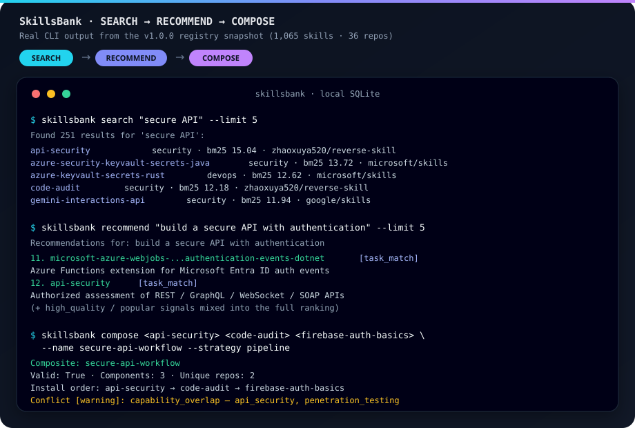
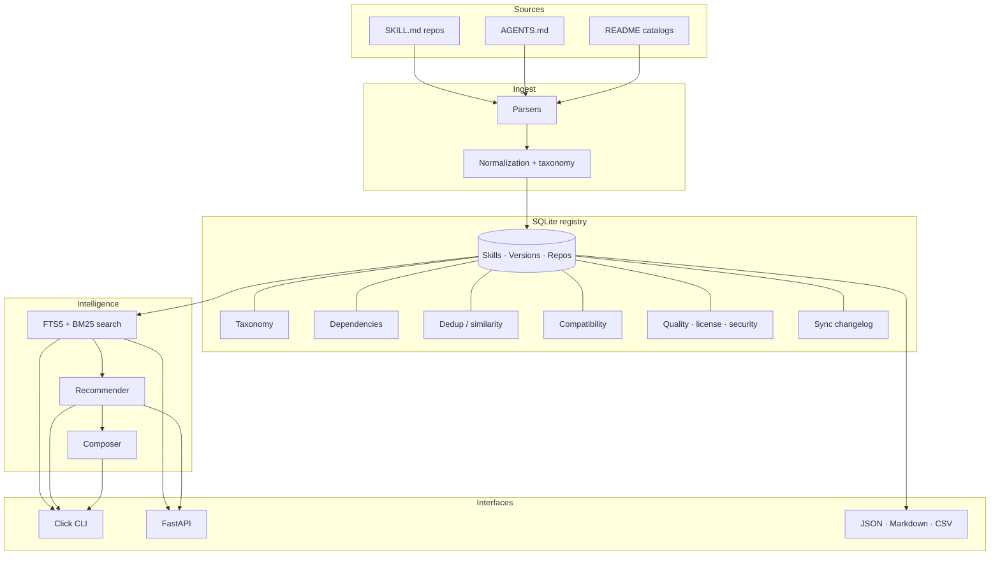

# SkillsBank

### One searchable intelligence layer for AI agent skills.

[](https://www.python.org/downloads/)
[](https://github.com/2lost2bfound/Skillzbank/releases/tag/v1.0.0)
[](LICENSE)
[](https://github.com/2lost2bfound/Skillzbank/actions/workflows/ci.yml)
[](docs/API.md)
[](docs/ARCHITECTURE.md)

Agent skills are spreading across GitHub repositories, vendor ecosystems, MCP projects, coding agents, and individual developers.

Finding a file called `SKILL.md` is easy.

Knowing whether it is the **right** skill — or a duplicate, outdated, incompatible, dependent on external tooling, overlapping another skill, or useful as part of a larger workflow — is harder.

**SkillsBank turns scattered agent skills into a normalized, searchable, comparable, recommendation-capable registry.**

| Skills | Repositories | Capabilities | Tags | Agent profiles | Tests |
|-------:|-------------:|-------------:|-----:|---------------:|------:|
| **1,065** | **36** | **3,351** | **4,405** | **7** | **462 + 16** |

*v1.0.0 registry snapshot. Counts come from the shipped `registry.v3.json` / imported SQLite DB — re-run `skillsbank stats` after you import more sources.*

---

## The skill ecosystem has an indexing problem

Skills increasingly live across:

- Claude-oriented repositories
- Codex workflows
- OpenCode tools
- MCP projects
- vendor skill collections
- independent GitHub repos
- `AGENTS.md` files
- README-embedded instructions
- specialized coding and security workflows

The ecosystem has inconsistent naming, metadata, dependencies, structure, provenance, compatibility assumptions, and capability vocabulary.

Concrete consequences:

| Situation | Reality |
|-----------|---------|
| Two skills named `code-review` | May perform substantially different jobs |
| Two skills with unrelated names | May overlap heavily in capability |
| A skill mentions Docker / ffmpeg / Playwright / Ghidra | Often without clean structured dependency metadata |
| A skill ships in one ecosystem | Does **not** mean it only works there |

SkillsBank is the index and intelligence layer for that mess — not another place to write skills.

---

## From one JSON file to a skill intelligence platform

SkillsBank began as roughly a **1 MB** manually assembled `registry.json`.

Initial state:

- 1 JSON file
- ~1,065 records
- no database
- no CLI
- no API
- no reproducible importer
- no persistent parser architecture
- no tests
- no normalized taxonomy

Then the staged transformation:

```text
registry.json
│
▼
AUDIT
│
▼
TYPED DOMAIN MODEL  (Pydantic v2 · registry schema v3)
│
▼
NORMALIZED SQLITE
│
├── provenance
├── versions
├── taxonomy
├── dependencies
├── compatibility
├── quality
└── duplicate intelligence
│
▼
FTS5 + BM25
│
▼
SEARCH  →  RECOMMEND  →  COMPOSE
│
├── CLI
├── REST API
└── EXPORTS
```

Development loop:

```text
MEASURE → MODEL → IMPLEMENT → TEST → AUDIT → EXPAND
```

That loop is the public identity of the project: evidence over hype, provenance over guesswork, and a registry you can run on a laptop.

---

## SEARCH → RECOMMEND → COMPOSE

Three operations. Different questions.

| Operation | Question | Example |
|-----------|----------|---------|
| **SEARCH** | I roughly know the capability. Find relevant skills. | `skillsbank search "secure API"` |
| **RECOMMEND** | I know the task. Tell me which skills fit. | `skillsbank recommend "build a secure API with authentication"` |
| **COMPOSE** | I have a multi-stage job. Build a skill workflow. | `skillsbank compose <id> <id> <id> --name secure-api-workflow --strategy pipeline` |

Real output from the v1.0.0 registry snapshot:



<details>
<summary>Same demo as copy-pasteable terminal text</summary>

```text
$ skillsbank search "secure API" --limit 5
Found 251 results for 'secure API':
  api-security                         security  bm25 15.04  zhaoxuya520/reverse-skill
  azure-security-keyvault-secrets-java security  bm25 13.72  microsoft/skills
  azure-keyvault-secrets-rust          devops    bm25 12.62  microsoft/skills
  code-audit                           security  bm25 12.18  zhaoxuya520/reverse-skill
  gemini-interactions-api              security  bm25 11.94  google/skills

$ skillsbank recommend "build a secure API with authentication" --limit 5
  … high_quality / popular signals …
  microsoft-azure-webjobs-...authentication-events-dotnet  [task_match]
  api-security                                             [task_match]

$ skillsbank compose <api-security> <code-audit> <firebase-auth-basics> \
    --name secure-api-workflow --strategy pipeline
Composite: secure-api-workflow
  Valid: True · Components: 3 · Unique repos: 2
  Install order: api-security → code-audit → firebase-auth-basics
  Conflict [warning]: capability_overlap — api_security, penetration_testing
```

</details>

---

## What you get

### Full-text search
SQLite **FTS5** with **BM25** ranking, faceted filters (domain, category, repo, quality, risk), and prefix autocomplete.

### Capability taxonomy
Raw capability strings are normalized into **17 categories** and **100+ canonical capabilities** with alias mapping. Original names are preserved; canonical paths are additive.

### Duplicate intelligence
Five-dimension comparison (name, summary, capabilities, content hash, source). Classifications:

- exact duplicate
- near duplicate
- functional overlap
- related

Similarity is **not** identity. Overlap is reported; merges are not forced.

### Dependency intelligence
Extraction of packages, APIs, CLI tools, runtimes, and environment variables from skill content and declared metadata. Graph helpers for edges, cycles, and transitive deps.

### Compatibility engine
Seven agent profiles scored from structured signals (SKILL.md / MCP / shell / browser / runtime cues):

`claude` · `codex` · `opencode` · `gemini` · `cursor` · `mcp_client` · `generic_cli`

Levels are advisory (`SUPPORTED`, `LIKELY_SUPPORTED`, `REQUIRES_ADAPTER`, …) — not runtime certification.

### Quality / license / security metadata
Component scoring for documentation, metadata completeness, freshness, adoption, dependency clarity, and security posture. License pattern detection. Risk flags for shell, filesystem, network, browser, credentials, packages, and destructive potential.

SkillsBank does **not** claim formal security certification of upstream skills.

### Incremental synchronization
Content hashes, change detection (`ADDED` / `MODIFIED` / `REMOVED` / …), version preservation, and a sync changelog.

### Recommendations
Multi-signal ranking: task keyword match, similarity, same category, same ecosystem, popularity, and quality.

### Workflow composition
Distinct from recommendation. Takes concrete skill IDs, merges capabilities/deps, detects conflicts, and orders install steps (`sequential` / `parallel` / `pipeline`).

### CLI
Sixteen top-level commands: `search`, `autocomplete`, `recommend`, `recommend-for`, `export`, `skills`, `repos`, `compose`, `dedup`, `import`, `stats`, `rebuild-fts`, `normalize`, `deps`, `doctor`, `analytics`.

### REST API
Local FastAPI server with 13 application routes (`/health`, `/search`, `/autocomplete`, `/skills`, `/skills/{id}`, `/recommend`, `/recommend/{id}`, `/repos`, `/export/json`, `/export/csv`, `/export/stats`, `/search/stats`, `POST /admin/rebuild-fts`).

### Exports
Filtered **JSON** (v3-compatible), **Markdown**, and **CSV**.

---

## Local-first by design

Core registry operations do **not** require:

- a hosted database
- a vector database
- an LLM API key
- an embedding API
- a SaaS search provider

SQLite + FTS5 give useful local retrieval on a laptop. You clone the repo, import the shipped registry snapshot, and query offline after that.

*(Fetching new upstream skill sources from GitHub still needs network access — that is optional expansion, not core query.)*

---

## Built for the ecosystem, not one vendor

SkillsBank distinguishes:

| Axis | Meaning |
|------|---------|
| **Where a skill came from** | Provenance: repo, path, commit when known |
| **Where a skill may be usable** | Compatibility profiles across agents |

It is not exclusively a Claude, Codex, OpenCode, Gemini, or MCP product. It is an **agent-skill registry and intelligence platform** that spans ecosystems and keeps origin separate from usability.

---

## Quick start

> **Not on PyPI yet.** Install from this repository.

### User install

```bash
git clone https://github.com/2lost2bfound/Skillzbank.git
cd Skillzbank

python3 -m venv .venv
source .venv/bin/activate          # Windows: .venv\Scripts\activate

pip install .
skillsbank import registry.v3.json
skillsbank normalize
skillsbank doctor
skillsbank search "security audit"
skillsbank recommend "build a secure API with authentication"
skillsbank stats
```

### Developer install

```bash
pip install -e ".[dev]"
pytest -m "not slow and not integration"
ruff check skillsbank tests
```

### REST API

```bash
# Uses ./skillsbank.db by default (created/imported via CLI first)
uvicorn skillsbank.api:app --host 127.0.0.1 --port 8000
# Open http://127.0.0.1:8000/docs
```

---

## Architecture



### Terminology (important)

| Term | Meaning in this project |
|------|-------------------------|
| **Pydantic v2** | Python validation library used for domain models (`pydantic>=2.0`) |
| **Registry schema v3** | SkillsBank's own JSON schema / `registry.v3.json` format |
| **v2 registry** | Legacy `registry.json` snapshot (immutable input) |

These are different things. Do not write “Pydantic v3”.

### Package layout

```text
skillsbank/
  models/        Pydantic v2 domain models (registry schema v3)
  db/            SQLAlchemy 2.x persistence, import/export, migrations
  alembic/       Packaged Alembic migrations
  parsers/       SKILL.md · AGENTS.md · README
  taxonomy/      Categories + canonical capabilities
  dedup/         Fingerprint + multi-dimension similarity
  deps/          Extraction + dependency graph
  scoring/       License · quality · security
  compat/        Agent compatibility profiles
  sync/          Incremental change tracking
  search/        FTS5 + BM25 + facets
  recommender/   Multi-signal recommendations
  composition/   Multi-skill workflows
  exports/       JSON · Markdown · CSV
  api/           FastAPI app
  analytics/     Doctor + analytics
  perf/          Cache · eager load · benchmarks
  security/      Validation · safe errors · rate limits
  cli.py         Click entrypoint
```

---

## Verification

| Suite | Count | How to run |
|-------|------:|------------|
| Standard tests | **462** | `pytest -m "not slow and not integration"` |
| Slow SQLite round-trip | **16** | `pytest -m "slow or integration"` |
| Collected total | **478** | `pytest --collect-only -q` |

Also:

```bash
ruff check skillsbank tests
ruff format --check skillsbank tests
python -m build
skillsbank doctor
```

Release audit notes: [`docs/RELEASE_AUDIT_V1.0.0.md`](docs/RELEASE_AUDIT_V1.0.0.md).

---

## Roadmap (not shipped)

Future work only — **not** claimed as implemented:

- additional skill repositories and parser adapters
- richer ecosystem export adapters
- optional semantic / embedding retrieval
- skill benchmarking harnesses
- community source-submission workflow
- deeper compatibility analysis
- optional hosted / distributed registry mode

---

## Contributing

Good first contributions:

- add a source repository
- improve a parser
- correct taxonomy mapping
- report duplicate relationships
- improve dependency detection
- add or adjust compatibility profiles
- improve documentation

See [`CONTRIBUTING.md`](CONTRIBUTING.md). Security reports: [`SECURITY.md`](SECURITY.md).

Issue templates cover bugs, features, and skill-source submissions.

---

## License

[MIT](LICENSE) © 2lost2bfound

---

## Acknowledgments

v1.0.0 indexes skills from many upstream projects, including:

- [anthropics/skills](https://github.com/anthropics/skills)
- [mattpocock/skills](https://github.com/mattpocock/skills)
- [google/skills](https://github.com/google/skills)
- [microsoft/skills](https://github.com/microsoft/skills)
- [nvidia/skills](https://github.com/nvidia/skills)
- [openai/skills](https://github.com/openai/skills)
- [softaworks/agent-toolkit](https://github.com/softaworks/agent-toolkit)
- [huggingface/skills](https://github.com/huggingface/skills)
- [VoltAgent/awesome-agent-skills](https://github.com/VoltAgent/awesome-agent-skills)
- and other community repos listed in the registry

Upstream projects own their skill content and licenses. SkillsBank indexes metadata for discovery.

---

Agent skills are multiplying faster than anyone can manually organize them.

**SkillsBank is building the index before the library becomes impossible to navigate.**

If this is useful, star the repo, open an issue, or send a PR with a new source.
